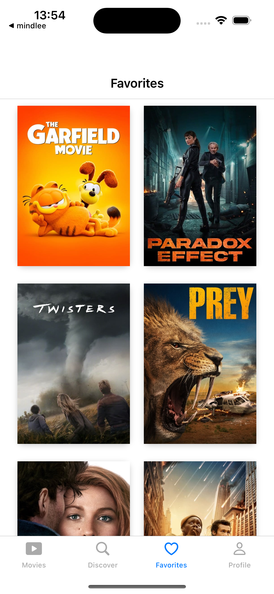

# OBSS INTERN - MOVIE DATABASE SWIFT APPLICATION

# Packages
#### - Kingfisher
#### - Lottie
#### - MessageKit
#### - Realm, RealmDatabase

# Application Screenshots

  </img>
  </img>
  </img>
  </img>

  </img>
  </img>
  </img>
  </img>

  </img>
  </img>
  </img>
  </img>

  </img>
  </img>
  </img>

